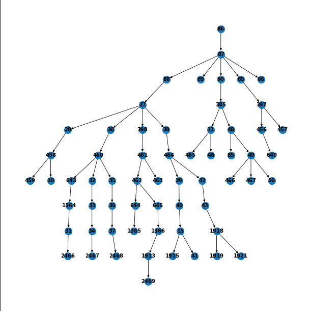

# Absolute element detection in Figma Design
**Problem:**
When we render a website in HTML, sometimes we have to use absolute elements. Absolute elements are
DOM elements in which they have CSS property `position: absolute`.
In order to convert a Figma Design to code, we could represent a Figma Design with 2 information:   
- screen
- image and a tree of Node.

In which each node in Figma Design will have these property
- node id
- minx, miny, maxx, maxx - which is a top left corner and bottom right corner of the node
- children: a Node in Figma Design could have many children, each child is a Node

Base on order of nodes in children, we could detect the z-index of a node. E.g: root node has 3 children with respective order:
- child 1
- child 2
- child 3 

It means that child 1 has z-index = 1, child 2 has z-index = 3 and child3 has z-index = 3 and if
child 2 and child1 overlap each other, then child 2 is upper and child1 is lower.

**Your task:**
Your mission is to write a function to take a root node, and a screenshot, and return a list of nodes which are absolute in the root node.


## Introduction and Problem Statement
Detecting elements' attributes in a design is a crucial step in the process of converting a design to code. In this project, we will focus on detecting absolute elements in a design. Absolute elements are DOM elements in which they have CSS property `position: absolute`. In order to detect the attributes of elements in a design, we could consider the design as a *tree of nodes*. Each node in the tree represents a DOM element in the design. Each node has the following attributes:
- node id
- location: a tuple of 4 values (minx, miny, maxx, maxy) which is a top left corner and bottom right corner of the node
- children: a Node in Figma Design could have many children, each child is a Node
- figma attributes: a dictionary of attributes of the node in Figma Design, i.e role, z-index, text, icon, etc.

Let's see a data example:
```
{
    "image_path": "screenshot.png",
    "nodes": [
        {
            "id": "86",
            "box": [
                0,
                0,
                1280,
                720
            ],
            "is_absolute": false,
            "role": "none"
        },
        {
            "id": "87",
            "box": [
                0,
                0,
                1280,
                6310
            ],
            "is_absolute": false,
            "role": "generic"
        },...
    ],
    "edges": [
        ["86", "87"],
        ...
    ]
}
```
In this example, we have a design with 2 nodes. The first node has id = 86, location = (0, 0, 1280, 720), is_absolute = false, role = none. The second node has id = 87, location = (0, 0, 1280, 6310), is_absolute = false, role = generic. The second node is a child of the first node. The edges list represents the parent-child relationship between nodes. In this example, node 87 is a child of node 86.

The objective of this project is to build a model that can detect absolute elements in a design, in another word, we need to predict the `is_absolute` attribute of each node in the design. This is a binary classification problem. We will dive into the details of the dataset, the approach, and the results in the following sections.


In the image above, we have 2 absolute elements: the first one is the **camera** icon on the right side of the search box, and the second one is the **number of items** icon on cart icon. They are visualized as green boxes in the image. The rest of the elements are not absolute elements.

Below is an example of graph representation of the design above:


The graph above is a tree of nodes. Each node has the node id as its label. The edges represent the parent-child relationship between nodes.

Now let's see [notebook.ipynb](notebook.ipynb) for more details about how we preparing the data and the problem.

## Dataset
To be able to train a model to detect absolute elements in a design, we need to have a dataset of designs with the ground truth of absolute elements. It's not easy to create a Figma Design dataset that has the ground truth of absolute elements. Therefore, we will use a crawled dataset from public website and capture the corresponding screenshot of each website. The public crawled dataset is published here: [WebUI dataset](https://github.com/js0nwu/webui). It contains 400,000 rendered web pages associated with automatically extracted metadata.

By using crawled dataset, we can have a huge amount of data to train our model. However, the crawled dataset should also have some drawbacks such as the inconsistency in the quality of the crawled data, each developer has different coding style, etc. In the future, to improve the quality of the dataset, we need to define the quality metrics for each data point in the dataset, then filter them to get the high-quality dataset. 

We then can extract the attributes of elements in the design from the metadata. The metadata is stored in a JSON file. Each JSON file contains the following attributes:
- `axtree.json`: a tree of nodes.
- `box.json`: a list of bounding boxes of elements.
- `style.json`: a list of styles of elements.
- `viewport.json`: whether the element is visible in the viewport or not.

Please see [notebook.ipynb](notebook.ipynb) for more details about how we extract the attributes of elements from the metadata.

We will extract the attributes and convert the metadata to the format in Introduction section. The dataset is stored in `data` folder.


## Approach
As the structure of the design is a tree of nodes, we can use a graph neural network to learn the representation of each node in the design. The graph neural network will take the graph as input and output the representation of each node, it has ability to learn the representation of each node based on the attributes of the node and the relationship between nodes. Then we can use the representation of each node to predict the `is_absolute` attribute of the node using a binary classifier.


Let's look at the architecture of the model we will use in this project:


For each attribute/location feature, we use a separate embedding layer to learn the representation of the attribute. Then we concatenate the representation of all attributes of a node to get the representation of the node. We use a graph neural network to learn the representation of each node based on the representation of the node and the relationship between nodes. We use a binary classifier to predict the `is_absolute` attribute of each node.

Below is model architecture in code, see model.py for more details:
```python
class Model(torch.nn.Module):
    """Node classification model using GCN"""

    def __init__(
        self,
        hidden_channels,
        graph_in,
        graph_out,
        hidden_dim,
        dropout=0.0,
        num_roles=120,
        max_layout_size=1281,
        role_pad_idx=0,
    ):
        super().__init__()
        self.role_pad_idx = role_pad_idx
        role_embedding_dim = 16
        layout_embedding_dim = 16
        self.role_embedding = torch.nn.Embedding(num_roles, role_embedding_dim, padding_idx=0)
        self.layout_embedding = torch.nn.Embedding(max_layout_size, layout_embedding_dim)
        assert len(hidden_channels) > 0

        self.linear = nn.Linear(role_embedding_dim + layout_embedding_dim * 4, graph_in)
        in_channels = graph_in
        self.convs = torch.nn.ModuleList()
        last_dim = hidden_channels[0]
        conv = SAGEConv
        self.convs.append(conv(in_channels, hidden_channels[0]))
        for i in range(len(hidden_channels) - 1):
            self.convs.append(conv(hidden_channels[i], hidden_channels[i + 1]))
            last_dim = hidden_channels[i + 1]
        self.convs.append(conv(last_dim, graph_out))

        self.dense = torch.nn.Sequential(
            nn.Linear(graph_out, hidden_dim),
            nn.Dropout(p=dropout),
            nn.ReLU(),
            nn.Linear(hidden_dim, hidden_dim),
            nn.Dropout(p=dropout),
            nn.ReLU(),
            nn.Linear(hidden_dim, 2),
        )
```

For evaluation, we use F1 score, precision and recall as the metrics. We will use the F1 score of the positive class as the metric to evaluate the model. The positive class is the absolute elements. We will use the F1 score of the positive class as the metric because the dataset is imbalanced, the number of absolute elements is much smaller than the number of non-absolute elements. Therefore, the F1 score of the positive class will be a better metric to evaluate the model.

## Baseline Result
Because of the limitation of time and resources, we only train the model on a small dataset. The dataset contains 5000 designs. We split the dataset into 4000 training samples and 1000 validation samples. We train the model for 100 epochs. The model achieves 0.77 F1 score on the validation set. The precision is 0.81 and the recall is 0.73. The model is overfitting on the training set. Therefore, we can improve the model by using a larger dataset and add more features to our dataset. We can also improve the model by using a better graph neural network architecture.

| Model | F1 | Precision | Recall | Accuracy |
| --- | --- | --- | --- | --- |
| GCN | 0.77 | 0.81 | 0.73 | 0.99 |

The model can be trained in only **5 mins** and the size of the model is only 1MB. Therefore, we can deploy the model to production easily on CPU instances.

Below is an example of the model's prediction on a design:


To do new inference, please see [inference.ipynb](inference.ipynb) for more details.

## Future Works
- [ ] Use a larger dataset, currently we only use 5000 designs out of 400,000 designs in the dataset.
- [ ] Add more features to the dataset, currently we only use the role attribue of elements in the design. We can add more features such as the attributes such as text, icon, etc.
- [ ] Add image features to the dataset by using an image encoder to encode the screenshot of the design, then add/concatenate the image features to the node features or we can use cross-attention to combine the image features and the node features.
- [ ] Use a better graph neural network architecture, we can use a more complex graph neural network architecture such as GAT, GIN, etc.
- [ ] If we are going to apply the model to production to generate the code from Figma design, we should consider the tradeoff between the precision and recall, we can tweak the threshold of the model to get the best precision and recall for our use case.
- [ ] The dataset is highly imbalanced, we should consider using a better training strategy for imbalanced dataset such as oversampling, undersampling, etc. We can also use weighted loss function to handle the imbalanced data problem.

These are main ideas to improve the model. Think outside the box, we can also handle the problem by using other approaches such as object detection, object segmentation, etc. 

I'm happy to discuss more about the ideas to improve the model!

## Appendix
### Installation
```
apt install graphviz

pip install -r requirements.txt
```

### Training
```
python train.py --do_train --do_eval --per_device_train_batch_size 32 --per_device_eval_batch_size 32 --learning_rate 1e-4 --warmup_ratio 0.01 --lr_scheduler_type cosine --save_strategy epoch --evaluation_strategy epoch --logging_strategy steps --logging_steps 20 --save_total_limit 2 --load_best_model_at_end True --optim adamw_torch --weight_decay 1e-2 --num_train_epochs 100 --metric_for_best_model eval_f1 --greater_is_better=True --dataloader_num_workers=8 --max_grad_norm=1.0 --overwrite_output_dir=True --output_dir ./outputs/ --report_to none
```

### Deployment
We can deploy model to production by using FastAPI and Ray Serve. Using Ray Serve, we can deploy the model to production easily on CPU instances with high throughput. We can also scale the model easily by using Ray Serve.

See [main.py](main.py) for more details.

## Technologies
- Graph Convolutional Network (GCN)
- PyTorch + PyTorch Geometric
- FastAPI + Ray Serve for deployment